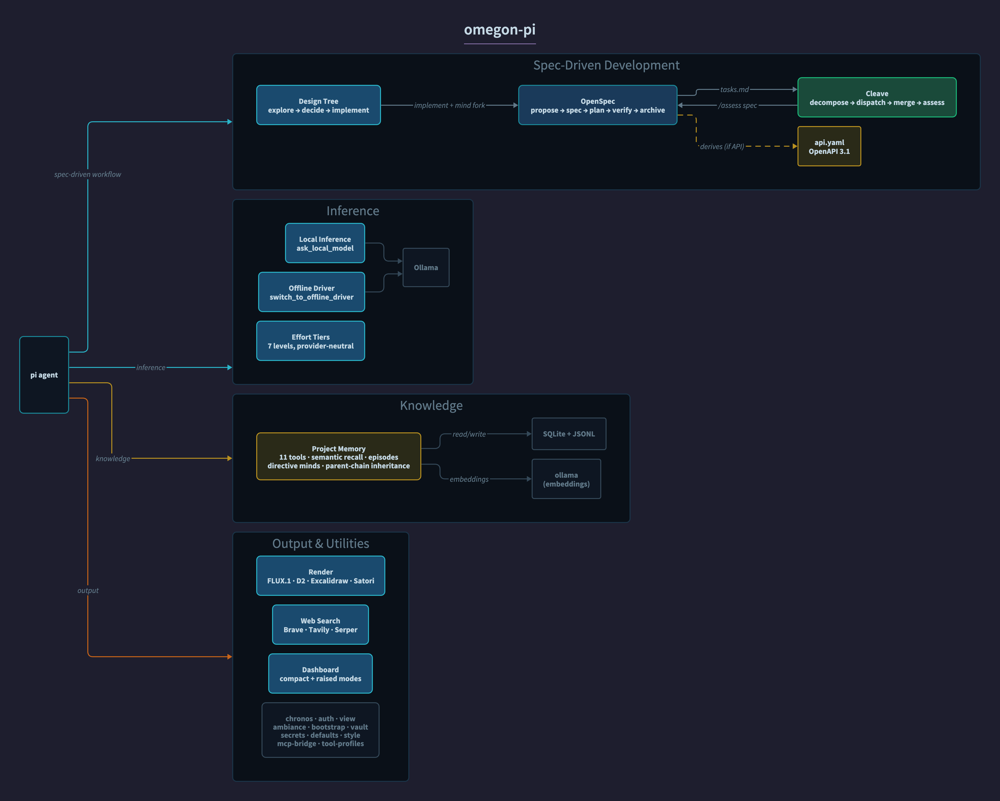
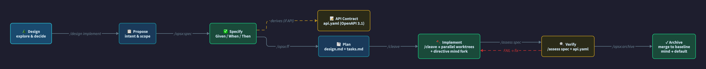
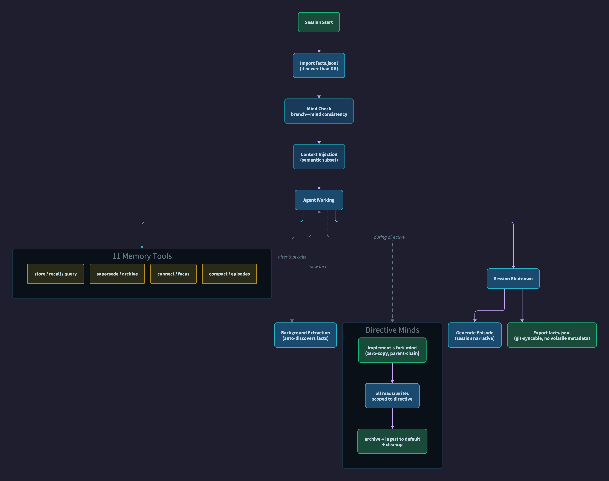

# devopet-agent

An opinionated distribution of [pi](https://github.com/badlogic/pi), the coding agent by [Mario Zechner](https://github.com/badlogic). devopet-agent bundles the pi core with omegon-pi extensions and it's own for persistent project memory, spec-driven development, local LLM inference, image generation, web search, parallel task decomposition, a live dashboard, and general quality-of-life tooling.

> **Relationship to omegon-pi:** devopet-agent is a fork of omegon-pi. It installs pi as an npm dependency and layers extensions on top. All credit for the omegon-pi coding agent goes to the omegon-pi contributors. If you want standalone omegon-pi without devopet-agent's extensions, install `omegon-pi` directly.

> **Relationship to pi:** omegon-pi is not a fork of pi. It installs pi as an npm dependency and layers extensions on top. All credit for the pi coding agent goes to Mario Zechner and the pi contributors. If you want standalone pi without omegon-pi's extensions, install `@mariozechner/pi-coding-agent` directly.


## Install

```bash
npm install -g devopet-agent
```

Requires **Node.js 20+**.

This installs the `omegon-pi` command globally. A `pi` alias remains available for compatibility. If a standalone pi package is already installed, omegon-pi takes over the lifecycle boundary (startup, update, restart). To switch back to standalone pi:

```bash
npm uninstall -g devopet-agent
npm install -g @mariozechner/pi-coding-agent
```

**First run:**

```bash
devopet-agent        # start in any project directory
/bootstrap       # check deps, install missing tools, set preferences
```

### Updates

| Context | How |
|--------|-----|
| Installed via npm | `/update` from inside devopet-agent — installs latest, verifies binary, clears caches, prompts restart. |
| Dev checkout | `/update` or `./scripts/install-pi.sh` — pulls, installs deps, `npm link`, prompts restart. |
| Cache refresh only | `/refresh` — clears caches and reloads extensions without package replacement. |

devopet-agent depends on upstream `@mariozechner/pi-coding-agent` from npm. To pick up a new pi release, bump the version in `package.json`.

## Architecture



devopet-agent extends `@mariozechner/pi-coding-agent` with **21 extensions**, **12 skills**, and **4 prompt templates**, loaded automatically on session start.

### Spec-driven development

devopet-agent enforces spec-first development for non-trivial changes:



The lifecycle: **design → propose → spec → plan → implement → verify → archive**. Given/When/Then scenarios are the source of truth — code implements the specs, not the reverse.

## Extensions

### OpenSpec

Spec-driven development lifecycle — proposal → specs → design → tasks, with delta-spec merge on archive.

- **Tool**: `openspec_manage`
- **Commands**: `/opsx:propose`, `/opsx:spec`, `/opsx:ff`, `/opsx:status`, `/opsx:verify`, `/opsx:archive`, `/opsx:sync`
- **Stages**: proposed → specified → planned → implementing → verifying → archived
- **API contracts**: When a change involves a network API, derives an OpenAPI 3.1 spec from Given/When/Then scenarios; `/assess spec` validates implementation against it
- Integrates with [OpenSpec CLI](https://github.com/Fission-AI/OpenSpec) profiles

### Cleave

Parallel task decomposition with dependency-ordered wave dispatch in isolated git worktrees.

- **Tools**: `cleave_assess` (complexity evaluation), `cleave_run` (parallel dispatch)
- **Commands**: `/cleave <directive>`, `/assess cleave`, `/assess diff`, `/assess spec`
- **OpenSpec integration**: Uses `tasks.md` as the split plan when `openspec/` exists, enriches children with design context, reconciles on merge
- **Skill-aware dispatch**: Matches skill files to children by file scope patterns (e.g. `*.py` → python, `Containerfile` → oci). `<!-- skills: python, k8s -->` annotations override
- **Model tier routing**: Each child resolves a tier — explicit annotation > skill hint > default
- **Review loop** (opt-in, `review: true`): After each child, a reviewer checks for bugs, security issues, and spec compliance. Severity-gated fix iterations with churn detection
- **Large-run preflight**: Prompts for provider preference before expensive dispatches

### Design Tree

Structured design exploration with persistent markdown documents — the upstream of OpenSpec.

- **Tools**: `design_tree` (query), `design_tree_update` (create/mutate)
- **Commands**: `/design list`, `/design new`, `/design update`, `/design branch`, `/design decide`, `/design implement`
- **Document structure**: Frontmatter (status, tags, deps, priority, issue type) + sections (Overview, Research, Decisions, Open Questions, Implementation Notes)
- **Work triage**: `design_tree(action="ready")` returns decided, dependency-resolved nodes sorted by priority
- **Blocked audit**: `design_tree(action="blocked")` shows stalled nodes with blocking dependency details
- **Priority**: 1 (critical) → 5 (trivial); `ready` sorts by it
- **Issue types**: `epic | feature | task | bug | chore`
- **Auto-transition**: Adding research or decisions to a `seed` node transitions it to `exploring` automatically
- **OpenSpec bridge**: `design_tree_update(action="implement")` scaffolds `openspec/changes/<node>/`, checks out a directive branch, forks a scoped memory mind, and sets focus
- **Full pipeline**: design → decide → implement → `/cleave` → `/assess spec` → archive

### Project Memory

Persistent, cross-session knowledge stored in SQLite. Accumulates architecture decisions, constraints, patterns, and known issues — retrieved semantically each session.

- **11 tools**: `memory_store`, `memory_recall`, `memory_query`, `memory_supersede`, `memory_archive`, `memory_connect`, `memory_compact`, `memory_episodes`, `memory_focus`, `memory_release`, `memory_search_archive`
- **Semantic retrieval**: Embedding search via Ollama (`qwen3-embedding`), falls back to FTS5
- **Background extraction**: Auto-discovers facts from tool output without interrupting work
- **Episodic memory**: Generates session narratives at shutdown
- **Directive minds**: `implement` forks a scoped mind from `default`; reads/writes auto-scope to the directive. `archive` ingests discoveries back and cleans up. Zero-copy fork with parent-chain inheritance
- **Global knowledge base**: Cross-project facts at `~/.pi/memory/global.db`
- **Git sync**: Exports to JSONL for version-controlled knowledge sharing; volatile runtime metadata omitted for stable diffs
- **Auto-compact**: Context pressure monitoring with automatic compaction
- **Session log**: Append-only structured session tracking



### Dashboard

Live status panel showing design tree, OpenSpec changes, cleave dispatch, and git branches.

- **Commands**: `/dash` (toggle compact/raised), `/dashboard` (side panel)
- **Compact mode**: Single footer line — design/openspec/cleave summaries + context gauge
- **Raised mode**: Full-width expanded view
  - Git branch tree annotated with linked design nodes
  - Two-column split at ≥120 columns: design tree + cleave left, OpenSpec right
  - Directive indicator with branch match status
  - Context gauge, model, thinking level in footer
- **Keyboard**: `Ctrl+Shift+B` toggles raised/compact

### Web UI

Localhost-only, read-only HTTP dashboard exposing live state as JSON. Binds to `127.0.0.1`, not started automatically.

- **Command**: `/web-ui [start|stop|status|open]`
- **Endpoints**: `/api/state`, `/api/session`, `/api/dashboard`, `/api/design-tree`, `/api/openspec`, `/api/cleave`, `/api/models`, `/api/memory`, `/api/health`

### Inference

Local models, effort tiers, model budget control, and offline driver switching.

- **Tools**: `set_model_tier`, `set_thinking_level`, `switch_to_offline_driver`, `ask_local_model`, `list_local_models`, `manage_ollama`
- **Commands**: `/local-models`, `/local-status`, `/effort <name>`, `/effort cap`, `/effort uncap`
- **Effort tiers**: Seven tiers from local-only to max capability. Tier labels resolve to concrete model IDs through the session's routing policy (Anthropic or OpenAI):

| Tier | Driver | Thinking |
|------|--------|----------|
| 1 | local | off |
| 2 | local | minimal |
| 3 | mid | low |
| 4 | mid | medium |
| 5 | mid | high |
| 6 | max | high |
| 7 | max | high |

- **Local inference**: Delegate sub-tasks to Ollama — zero API cost
- **Offline driver**: Switch from cloud to local when connectivity drops
- **Hardware-aware**: Model registry covers 8GB–64GB systems

### Ambiance

Themed loading messages and ambient scrolling text during long operations.

### Render

Generate images and diagrams in the terminal.

- **FLUX.1 image generation** via MLX on Apple Silicon — `generate_image_local`
- **D2 diagrams** rendered inline — `render_diagram`
- **Native SVG/PNG diagrams** (pipeline, fanout, panel-split motifs) — `render_native_diagram`
- **Excalidraw** JSON-to-PNG — `render_excalidraw`
- **React compositions** (still + animated GIF/MP4) via Satori — `render_composition_still`, `render_composition_video`

### Web Search

Multi-provider web search with deduplication.

- **Tool**: `web_search`
- **Providers**: Brave, Tavily, Serper (Google)
- **Modes**: `quick` (single provider), `deep` (more results), `compare` (all providers, deduped)

### Tool Profiles

Enable/disable tools and switch named profiles to keep the context window lean.

- **Tool**: `manage_tools`
- **Command**: `/profile [name|reset]`

### Other extensions

| Extension | Description |
|-----------|-------------|
| `00-splash` | Startup animation and loading checklist |
| `bootstrap` | First-time setup, dependency checking, version checking (`/bootstrap`, `/refresh`, `/update`) |
| `chronos` | Authoritative date/time from system clock — prevents AI date math errors |
| `01-auth` | Auth status and diagnostics across git, GitHub, GitLab, AWS, k8s, OCI (`/auth`, `/whoami`) |
| `view` | Inline file viewer — images, PDFs, docs, syntax-highlighted code |
| `defaults` | Deploys `AGENTS.md` and theme on first install; content-hash guard prevents overwriting customizations |
| `style` | Design system reference (`/style`) |
| `vault` | Markdown viewport with wikilink navigation (`/vault`) |
| `secrets` | Resolve secrets from env vars, shell commands, or system keychains |
| `mcp-bridge` | Connect external MCP servers as native pi tools |

## Skills

Skills are specialized instruction sets the agent loads on-demand when a task matches.

| Skill | Description |
|-------|-------------|
| `openspec` | OpenSpec lifecycle — specs, API contracts, task generation, verification |
| `cleave` | Task decomposition, code assessment, OpenSpec integration |
| `git` | Conventional commits, semantic versioning, branch naming, changelogs |
| `oci` | Containerfile authoring, multi-arch builds, registry auth, image management |
| `python` | Project setup, pytest, ruff, mypy, packaging, venv |
| `rust` | Cargo, clippy, rustfmt, Zellij WASM plugin development |
| `typescript` | Strict typing, async patterns, error handling, node:test |
| `pi-extensions` | pi extension API — commands, tools, events, TUI context |
| `pi-tui` | TUI component patterns — Component interface, overlays, keyboard, theming |
| `security` | Input escaping, injection prevention, path traversal, process safety, secrets |
| `style` | Color system, typography, spacing — shared across TUI, diagrams, and generated images |
| `vault` | Obsidian-compatible markdown — wikilinks, frontmatter, vault-friendly organization |

## Prompt Templates

| Template | Description |
|----------|-------------|
| `new-repo` | Scaffold a new repository with conventions |
| `init` | First-session environment check — orient to a new project |
| `status` | Session orientation — load project state and show what's active |
| `oci-login` | OCI registry authentication |

## Requirements

- **Node.js 20+**
- `npm install -g devopet-agent`

**Optional** (installed by `/bootstrap`):
- [Ollama](https://ollama.ai) — local inference, offline mode, semantic memory search
- [d2](https://d2lang.com) — diagram rendering
- [mflux](https://github.com/filipstrand/mflux) — FLUX.1 image generation (Apple Silicon)
- API keys for web search (Brave, Tavily, or Serper)

## License

ISC.
