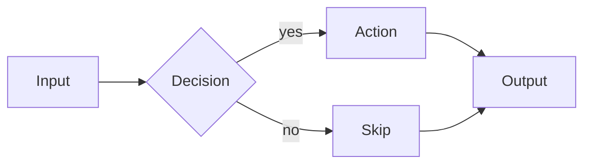
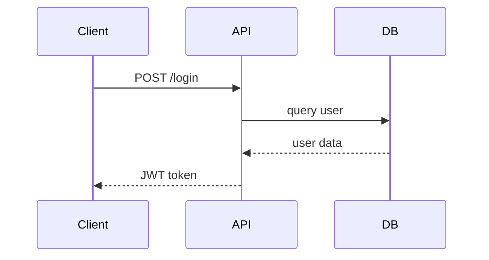
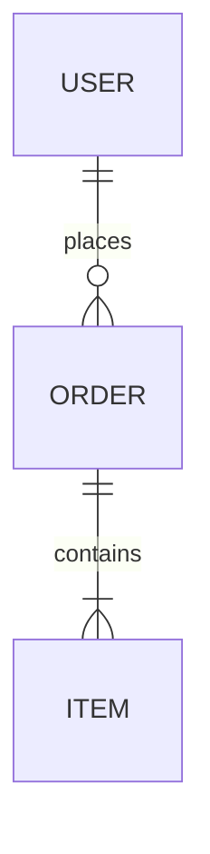
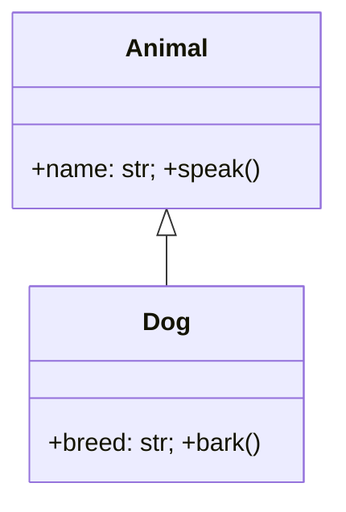
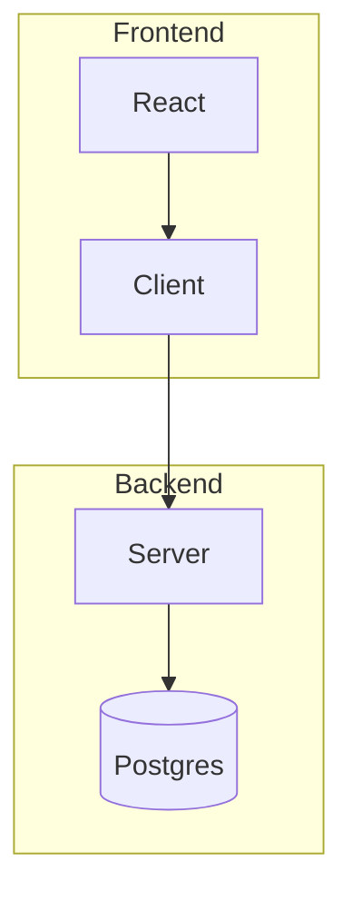

# Visualize Skill

Unified skill for visual content: diagram rendering (Mermaid) and AI image generation (FLUX.1 via MLX).

## Diagram Rendering (Mermaid)

Use the `render_diagram` tool to render inline Mermaid code directly in the terminal:

```
render_diagram(code="flowchart TB\n  A[Start] --> B[End]", title="My Diagram")
```

Use the `view` tool for `.mmd` or `.mermaid` files on disk:

```
view(path="docs/architecture.mmd")
```

If `mmdc` (Mermaid CLI) is installed, diagrams render as inline PNG images. Otherwise they display as syntax-highlighted source.

### Supported Diagram Types

| Type | Syntax | Use Case |
|------|--------|----------|
| Flowchart | `flowchart TB/LR` | Process flows, decision trees |
| Sequence | `sequenceDiagram` | API flows, message protocols |
| Class | `classDiagram` | OOP designs, data models |
| ER | `erDiagram` | Database schemas |
| State | `stateDiagram-v2` | State machines |
| Gantt | `gantt` | Project timelines |
| Git Graph | `gitGraph` | Branch strategies |
| Pie | `pie` | Distributions |
| Timeline | `timeline` | Historical events, roadmaps |

### Quick Syntax Reference

**Flowchart:**


Node shapes: `[rect]` `(rounded)` `{diamond}` `((circle))` `[(cylinder)]`
Arrows: `-->` `-.->` `==>` `--label-->`

**Sequence:**


**ER:**

Cardinality: `||--||` (1:1) · `||--o{` (1:many) · `}o--o{` (many:many)

**Class:**


**Subgraphs:**


### Install mmdc for Rendering

```bash
npm install -g @mermaid-js/mermaid-cli
# or
brew install mermaid-cli
```

Without mmdc, diagrams display as syntax-highlighted source. With mmdc, they render as inline images.

---

## AI Image Generation (Local Diffusion)

Use `generate_image_local` to generate images on-device using FLUX.1 via MLX. No cloud API — runs entirely on Apple Silicon.

### Presets

| Preset | Model | Speed | Quality | Use For |
|--------|-------|-------|---------|---------|
| `schnell` | FLUX.1-schnell | ~10s | Good | Fast iteration |
| `dev` | FLUX.1-dev | ~60s | Best | Final outputs |
| `dev-fast` | FLUX.1-dev | ~30s | High | Balanced |
| `diagram` | schnell | ~10s | Good | Technical diagrams (1024×768) |
| `portrait` | dev | ~60s | Best | Portrait (768×1024) |
| `wide` | schnell | ~10s | Good | Cinematic (1344×768) |

### Usage

```
generate_image_local(
  prompt="a clean architectural diagram showing microservices with arrows",
  preset="diagram"
)
```

Use quantization to reduce VRAM and speed up generation:
```
generate_image_local(prompt="...", preset="dev", quantize="4")
```

### Tips

- Use `schnell` for fast drafts, `dev` for quality finals
- `diagram` preset gives 4:3 landscape good for technical visuals
- `seed` parameter makes results reproducible
- `/diffuse <prompt>` as a quick command shortcut
</content>
</invoke>